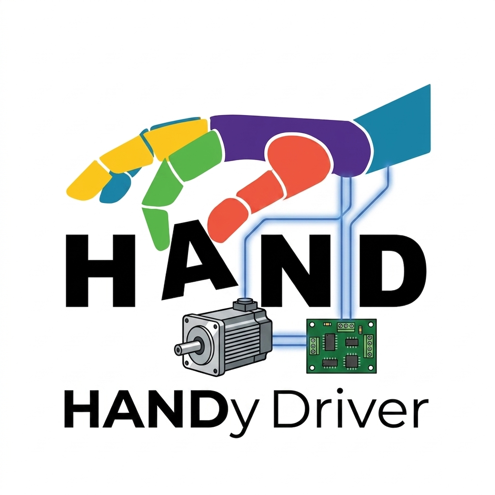

# HANDyDriver: Open-Source Motor Driver Board

HANDyDriver is an open-source BLDC motor driver board designed for versatility and small size, targeted to applications in haptics and dextrous manipulation in robotics. 

It is maintained by the [Center for Robotics and Biosystems at Northwestern University](https://robotics.northwestern.edu/), and supported by the [National Science Foundation HAND ERC](https://hand-erc.org/).

## Software Library: NU Control
A motor control library targeting the arduino Teensy is maintained alongside this hardware design. See the [NUControl](https://github.com/NU-AIET/NUControl) repo for more information.